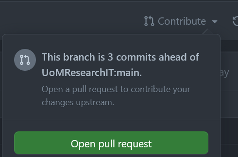
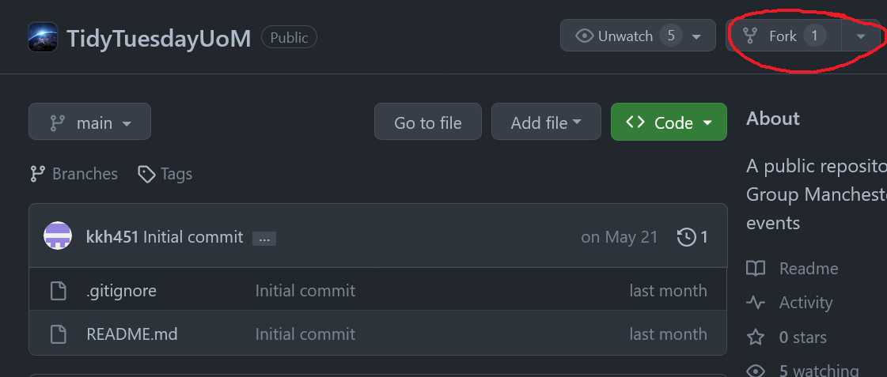
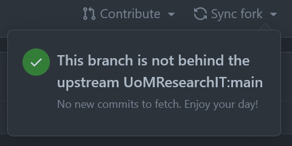

# Contributing

There are two main ways to contribute your code to this repository, either by forking and creating a pull-request, or by sending us your code and submitting it.  
We outline these below.

## Fork and pull-request

If you are familiar with Git and\|or GitHub forking this repository and creating a pull request is the recommended way to contribute your R code to the repository. You can then add your contributed code to the appropriate folder and create a pull request.  
You might also want to create a branch for your code but that is not necessary.  
Usually you will be given the option to create a pull request in the web UI when you have updated your fork, if you are not you can use te menu above your repository directory in the web UI to create a pull request via the contribute button.



### Forking

You can fork this repository from the web UI by clicking the fork button in the UI menu



## Staying up to date

It is not necessary to keep your fork up to date with the whole of the original repository. However, if you want your forked repository to have a similar history we outline how to do it below,

### Remotes

If you're familiar with adding remote repositories on GitHub using Git locally on your own machine you can keep up to date with the upstream (i.e. the original repository that you forked) by adding the upstream as a new remote with the following command,

```{git}
git remote add upstream git@github.com:UoMResearchIT/TidyTuesdayUoM.git
git fetch upstream
git pull upstream main
```

### Using the GitHub web UI

If you're more familiar with Git and GitHub via the GitHub UI you can stay up to date with the upstream by 'syncing' your fork, as is demonstrated below,



## Send us your code

Alternatively, if you want to contribute your code but do not want to use GitHub please send it to us and we will add it to the repository.

## Naming convention

We recommend that you name your scripts something like `yyyy-mm-dd_AB` where `yyyy-mm-dd` is the meeting date and `AB` are your initials.
